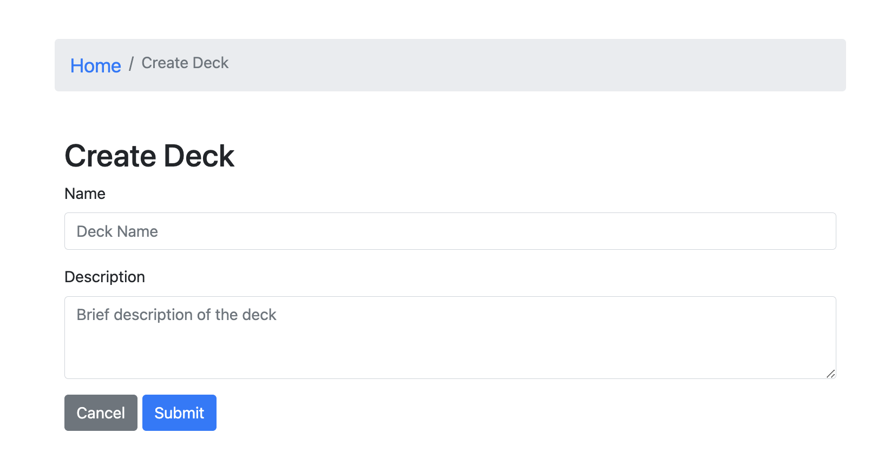

# Flashcard-o-matic

## Overview
Flashcard-o-matic is a web application designed to facilitate online studying for students at a local school. Teachers can use this application to create decks of flashcards for their subjects, and students can study these decks to reinforce their learning. This project assesses your ability to work with rendering and state management using React.

## Project Setup
1. Download the Qualified assessment files to your computer.
2. Run `npm install` to install the project locally.
   - **Note**: Work on this project locally, as Qualified's online IDE and Web Preview features may not work properly for this assessment.

## Running the Project
- To run the tests, use the command: `npm test`
- To run the application, use the command: `npm start`

## Project Structure
- The project includes a React application running on http://localhost:3000 and an API server on http://localhost:5000.
- Ensure you have a good understanding of:
  - Installing packages via NPM
  - Running tests from the command line
  - Writing React function components
  - Creating routes, including nested routes, using React Router
  - Using hooks like useState(), useParams(), and useHistory()
  - Debugging React code through console output and using the VS Code debugger

## API
- The project utilizes two datasets: `decks` and `cards`.
- The API functions (create, read, update, delete) are provided in `src/utils/api/index.js`.
- Refer to the documentation in the file for more information.

## Screens
### Home
- Path: `/`
- Features:
  - Create Deck button
  - List of existing decks with options to Study, View, and Delete
  - Delete prompts for confirmation

### Study
- Path: `/decks/:deckId/study`
- Features:
  - Breadcrumb navigation bar
  - Deck title display
  - Cards shown one at a time with flip and next buttons
  - Restart prompt
  - Not enough cards message and button to add cards

### Create Deck
- Path: `/decks/new`
- Features:
  - Breadcrumb navigation bar
  - Form for creating a new deck

### Deck
- Path: `/decks/:deckId`
- Features:
  - Breadcrumb navigation bar
  - Deck information display
  - Edit, Study, Add Cards, and Delete buttons
  - Card list with Edit and Delete buttons

### Edit Deck
- Path: `/decks/:deckId/edit`
- Features:
  - Breadcrumb navigation bar
  - Form for editing an existing deck

### Add Card
- Path: `/decks/:deckId/cards/new`
- Features:
  - Breadcrumb navigation bar
  - Form for adding a new card to an existing deck

### Edit Card
- Path: `/decks/:deckId/cards/:cardId/edit`
- Features:
  - Breadcrumb navigation bar
  - Form for editing an existing card

## Utility Functions
- Use the utility functions provided in `src/utils/api/index.js` for CRUD operations.

## Notes
- Follow the instructions strictly regarding file locations and names.
- If you encounter issues or have questions, reach out for help.
